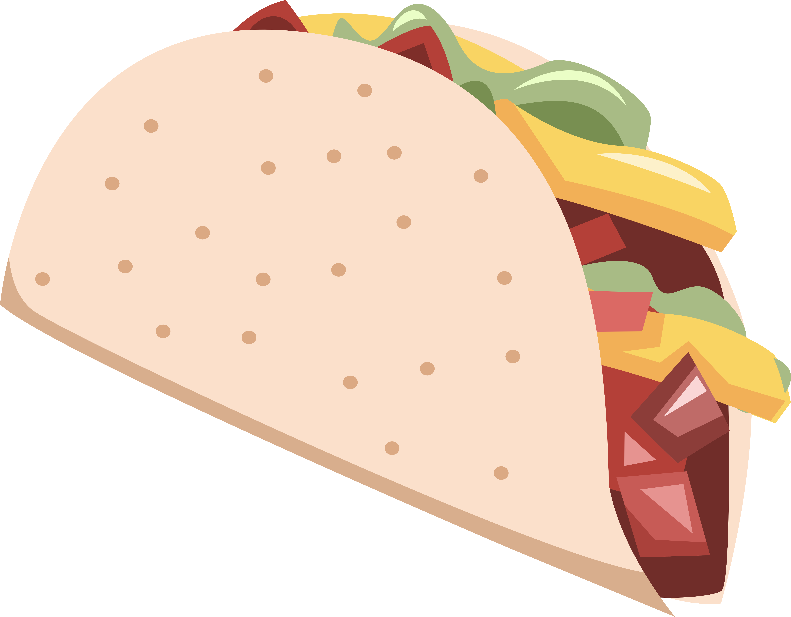

# A movies and series app for cinema maniacs.

  
   
  <h3><b>Foodfree</b></h3>

<!-- TABLE OF CONTENTS -->

# 📗 Table of Contents

- [📖 About the Project](#about-project)
  - [🛠 Built With](#built-with)
    - [Tech Stack](#tech-stack)
    - [Key Features](#key-features)
    - [Future Features](#🔭-future-features)
  - [🚀 Live Demo](#live-demo)
- [👥 Author](#authors)
- [🤝 Contributing](#contributing)
- [⭐️ Show your support](#support)
- [🙏 Acknowledgements](#acknowledgements)
- [📝 License](#license)

<!-- PROJECT DESCRIPTION -->

# 📖 Foodfree 

Watch your favourite shows. See likes and comments from users. Like and comments on any show you want!
For future implementations, please go to the [Future Features](#future-features) section. [Click here to see the Live Demo]().

## 🛠 Built With 

### Tech Stack 

  <ul>
    <li><a href="https://https://html5.org//">HTML 5</a></li>
    <li><a href="https://www.w3.org/Style/CSS/Overview.en.html">CSS 3</a></li>
    <li><a href="https://www.javascript.com/">JavaScript</a></li>
    <li><a href="https://www.npm.com/">npm</a></li>
    <li><a href="https://webpack.js.org/">webpack</a></li>
  </ul>

<!-- Features -->

### Key Features 

- **Find a show you love**
- **Like and comment on your favorite shows**

## 🔭 Future Features 

- **UI/UX imprivements

<!-- LIVE DEMO -->

## 🚀 Live Demo 

- [Live Demo Link](https://astroboyreloaded.github.io/JavaScript-Capstone-M2/dist)
<!-- AUTHORS -->

## Authors 

👤 **astroboyReloaded**

- GitHub: [astroboyReloaded](https://github.com/astroboyReloaded)
- Twitter: [@astroboyReload](https://twitter.com/astroboyReload)
- LinkedIn: [LinkedIn](https://www.linkedin.com/in/astroboyreloaded/)

👤 Nafeur Rahman Adil

- GitHub: [@nxn404-n/](https://github.com/nxn404-n/)
- Twitter: [@nxn_404](https://twitter.com/nxn_404)
- LinkedIn: (https://www.linkedin.com/in/nafeurrahmanadil/)

<!-- CONTRIBUTING -->

## 🤝 Contributing 

Please let me know if you find any issues in this repo's code!
Feel free to check the [issues page](../../issues/).

<!-- SUPPORT -->

## ⭐️ Show your support 

If you like our work on this project, please give me a star on this repo. I would also love to read your comment letting me know what you think!

<!-- ACKNOWLEDGEMENTS -->

## 🙏 Acknowledgments 

Thanks to [Microverse](https://www.microverse.org/) for giving me a path to follow in this learning journey!
Thanks to my mates, who walk by and share they experiences and knowledge with me during this journey: you make this experience even more valuable!
Thanks to [GitHub](https://github.com/) for being so awesome!

<!-- LICENSE -->

## 📝 License 

[MIT](https://mit-license.org/)

(<a href="#readme-top">back to top</a>)

